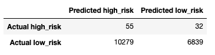
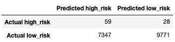
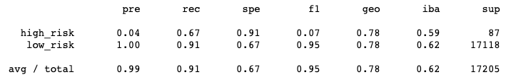

# Credit_Risk_Analysis

## Overview
Building and evaluating several machine learning models to predict credit risk.\
Using the following procedure:
- oversample the data using the **RandomOverSampler** and **SMOTE** algorithms.
- Undersample the data using the **ClusterCentroids** algorithm.
- Use a combinatorial approach of over- and undersampling using the **SMOTEENN** algorithm.
- Compare two machine learning models that reduce bias, **BalancedRandomForestClassifier** and **EasyEnsembleClassifier**.

We will evaluate the performance of these models and make a recommendation on whether they should be used to predict credit risk.

## Resources
- Data Source: LoanStats_2019Q1.csv
- Tech Used: Python, Anaconda Navigator, Conda, Jupyter Notebook

## Results (Balanced Accuracy Scores, Confusion Matrixes and Imbalanced Classification Reports)

### RandomOverSampler model

The balanced accuracy score is 65%. The high_risk precision is about 1% only with 62% sensitivity which makes a F1 of 2% only. Due to the high number of the low_risk population, its precision is almost 100% with a sensitivity of 68%.

### SMOTE model

The results are pretty similar to the previous model. The balanced accuracy score is 64%.The high_risk precision is about 1% only with 63% sensitivity which makes a F1 of 2% only. Due to the high number of the low_risk population, its precision is almost 100% with a sensitivity of 66%.

### ClusterCentroids model

Here the balanced accuracy score is down to about 52%. The high_risk precision is still 1% only with 63% sensitivity which makes a F1 of 1%. Due to the high number of false positives, the low_risk sensitivity is only 40%.

### SMOTEENN model

The balanced accuracy score is about 62%. The high_risk precision is still 1% only with 68% sensitivity which makes a F1 of only 2%. Due to the high number of false positives, the low_risk sensitivity is 57%.

### BalancedRandomForestClassifier model

The balanced accuracy score improved to about 79%. The high_risk precision is still low at 4% only with 67% sensitivity which makes a F1 of only 7%. Due to a lower number of false positives, the low_risk sensitivity is now 91% with 100% presicion.

### EasyEnsembleClassifier model

Now, the balanced accuracy score is high to about 93%. The high_risk precision is still low at 7% only with 91% sensitivity which makes a F1 of only 14%. Due to a lower number of false positives, the low_risk sensitivity is now 94% with 100% presicion.

## Summary
All the models used to perform the credit risk analysis show weak precision in determining if a credit risk is high.

The EasyEnsembleClassifier model shows a recall of 92% so it detects almost all high risk credit. On another hand, with a low precision, a lot of low risk credits are still falsely detected as high risk which would penalize the bank's credit strategy and infer on its revenue by missing those business opportunities.

We would not recommend the bank to use any of these models to predict credit risk.